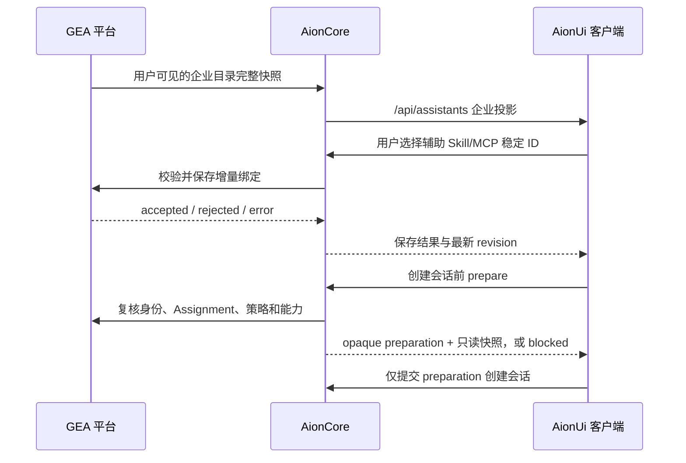

# GEA 与 AionUi 企业资源同步对接说明 V1

> 状态：客户端先行对接稿  
> 面向：GEA 平台、AionCore、AionUi 开发  
> 日期：2026-08-12  
> 目的：让 GEA 能向企业用户客户端同步助手、Skill、MCP、Agent 及相关管控状态，并接收用户允许的辅助能力增量。

## 1. 本轮改动解决什么问题

AionUi 正在把原来的“官方助手”入口改造成“企业助手”入口。企业助手不是用户复制后自行维护的一份普通助手，而是 GEA 分配给当前租户和用户的受管配置：

- GEA 管理助手身份、指令、Agent、默认模型和权限、必需 Skill/MCP、启停状态及最低客户端版本。
- AionUi 展示企业目录，但不允许用户修改、删除、降级或替换企业核心能力。
- 用户只能在 GEA 策略允许时添加辅助 Skill/MCP；是否接受由 GEA/AionCore 最终判断。
- 涉及生产业务写入的 MCP 必须由企业助手固定绑定，用户辅助能力不得替换或绕过它。
- 每次会话创建前由 AionCore 原子解析最终配置；任一必需能力、身份或权限不满足时阻断，不允许“少一个能力也先运行”。

目标不是把更多配置页堆进客户端，而是形成一条连续链路：



## 2. 系统边界

### 2.1 GEA 是这些数据的权威来源

- 企业助手模板与版本。
- 用户/租户的助手 Assignment。
- 企业发布的 Skill、MCP、Agent 资源元数据和版本。
- 企业助手必需能力、默认策略、生产写入标记。
- 用户辅助能力是否允许、最终绑定结果及冲突状态。
- Assignment 的暂停、撤回、强制启用和最低客户端版本。
- 企业身份、租户和授权复核结果。

### 2.2 AionCore 是客户端唯一业务网关

AionUi Renderer 不直接访问 GEA。AionCore 负责：

- 使用现有登录身份和租户上下文调用 GEA。
- 校验 GEA Schema、敏感字段、revision 和模板迁移规则。
- 将 GEA 数据投影为现有 `/api/assistants`、`/api/skills`、`/api/mcp/*`、`/api/agents/management` 契约。
- 安全下载或物化 Skill/Agent 运行包。
- 持有 MCP/Agent 的本地运行配置和认证状态。
- 原子准备并消费会话配置。
- 保留 last-good 快照，但明确标记陈旧状态。

现有 GEA 登录凭据由 Electron Main 的认证服务持有时，AionCore 同步实现必须通过仅限回环地址、进程内存持有的受控委派通道复用该身份。不得把登录 token 放入 Renderer、`/api/client-resources/sync` 请求体、本地普通配置或日志。WebUI 模式应使用服务端已认证会话提供等价委派；客户端与 AionCore 联调前必须先验证这条身份链路。

### 2.3 AionUi 只负责交互和本地草稿

- 展示目录、同步状态、阻断原因和修复动作。
- 锁定企业核心字段。
- 收集允许的辅助 Skill/MCP ID。
- 对明显违规做本地快速反馈，但不冒充企业授权。
- `unknown_external_write` 时保留草稿并要求核验，不自动重试。

### 2.4 客户端安装自带 Skill 与 GEA Skill 必须分源

- AionUi 随安装包提供且 `source=builtin`、`is_auto_inject=true` 的系统必需 Skill，在“我的技能 / 安装自带”展示；默认启用，用户只能对可编辑助手关闭或重新启用，不能删除或修改内容。
- 普通 `source=builtin` Skill 继续在“官方技能”中作为只读目录展示，不混入用户导入技能。
- GEA 同步的 Skill 必须使用企业稳定 `skill_id` 和受管来源，不能伪装成本地 `builtin`，也不能覆盖客户端安装自带 Skill。
- 企业助手的必需 Skill 是否可用仍由 GEA/AionCore 在保存增量和 `prepare` 时裁决；AionUi 不对受管助手开放本地关闭入口。

## 3. 必须统一的标识和版本规则

所有跨端对象都必须使用稳定 ID，不得使用显示名称、本地路径或 URL 作为关联键。

| 对象 | 稳定标识 | 版本/并发字段 | 说明 |
| --- | --- | --- | --- |
| 企业目录 | `tenant_id` | `revision` | 任意目录内容变化都生成新 revision |
| 助手模板 | `template_id` | `template_version` | 同版本内容不可变化 |
| 用户分配 | `assignment_id` | 目录 `revision` | 不得改指其他 template |
| 助手实例 | `assistant_id` | 跟随 Assignment | AionUi 列表和会话使用的 ID |
| Skill | `skill_id` | `version` + `digest` | 名称只用于展示 |
| MCP | `mcp_id` | `version` | 凭据和认证状态不进入目录 |
| Agent | `agent_id` | `version` | 运行包或远程服务必须可解析 |
| 用户增量 | Assignment | `expected_revision` | 保存必须带幂等键 |
| 会话准备 | `preparation_id` | `revision` + `expires_at` | 只能由创建会话接口原子消费 |

版本规则：

1. 所有目录读接口返回完整快照或 `not_modified`，客户端不拼接服务端部分补丁。
2. 同一 `revision` 返回不同内容属于服务端错误。
3. 删除字段、修改字段语义或收紧既有枚举必须升级 `schema_version`。
4. 新增可选字段可保持当前版本，旧客户端必须忽略未知字段。
5. GEA 返回时间统一使用带时区的 ISO 8601。

## 4. GEA 需要提供的接口

以下 URL 是建议命名，可以按 GEA 现有网关规范调整；字段语义和安全边界需要保持一致。

### 4.1 企业助手目录：已由客户端契约锁定

```http
GET /aidata/assistant-catalog/my?revision=<current_revision>
X-Access-Token: <existing-login-token>
```

返回三种状态：

```json
{
  "status": "ok",
  "snapshot": {
    "schema_version": 1,
    "revision": "catalog-r42",
    "generated_at": "2026-08-12T10:00:00+08:00",
    "tenant_id": "tenant-001",
    "assignments": []
  }
}
```

```json
{ "status": "not_modified", "revision": "catalog-r42" }
```

```json
{
  "status": "error",
  "error": {
    "code": "GEA_TEMPORARILY_UNAVAILABLE",
    "category": "retryable_read",
    "retryable": true
  },
  "last_good_revision": "catalog-r41"
}
```

每个 Assignment 至少包含：

- `assignment_id`、`assistant_id`。
- `activation`: `optional | required`。
- `state`: `active | suspended | withdrawn`，以及可选 `state_reason`。
- `minimum_client_version`、`updated_at`。
- `manifest.template_id`、`manifest.template_version`。
- 多语言名称、描述、头像。
- `agent.id`、`agent.type`、可选 `agent.acp_backend`。
- 系统指令和推荐提示词。
- 默认模型、权限和思考级别。
- 必需 Skill/MCP 稳定引用。
- `user_extensions` 增量策略。
- 可选 `extensions`：GEA 已接受的用户增量投影。

当前精确可执行 Schema：

- `packages/desktop/src/common/types/agent/enterpriseAssistantCatalog.ts`
- `docs/specs/gea-enterprise-assistant-catalog-v1.zh-CN.md`（集成分支）

### 4.2 企业资源目录：GEA 与 AionCore 待共同冻结

建议增加一个同 revision 的资源快照，供 AionCore 解析助手清单中的稳定引用：

```http
GET /aidata/client-resource-catalog/my?revision=<current_revision>
```

建议响应：

```json
{
  "status": "ok",
  "snapshot": {
    "schema_version": 1,
    "revision": "resource-r19",
    "generated_at": "2026-08-12T10:00:00+08:00",
    "tenant_id": "tenant-001",
    "skills": [],
    "mcps": [],
    "agents": []
  }
}
```

Skill 元数据建议包含：

```json
{
  "id": "skill-expense-precheck",
  "version": "2.3.0",
  "name": { "default": "Expense Precheck", "translations": { "zh-CN": "费用预审" } },
  "description": { "default": "Validate expense evidence", "translations": {} },
  "artifact_ref": "gea-artifact://skill/skill-expense-precheck/2.3.0",
  "digest": "sha256:<hex>",
  "size_bytes": 12345,
  "state": "active",
  "minimum_client_version": "2.2.0"
}
```

要求：

- Skill 包不可变；内容变化必须生成新 `version` 和 `digest`。
- `artifact_ref` 由 AionCore 通过受认证接口解析，AionUi 不直接下载。
- 包内容不得包含凭据；物化前由 AionCore 校验 digest、大小、目录穿越和允许文件类型。
- 用户本机 Skill 不自动上传 GEA。GEA 只接收稳定 ID 的绑定意图；另一台设备缺少该 Skill 时必须显示待处理或阻断。

MCP 元数据建议包含：

```json
{
  "id": "mcp-oa-production",
  "version": "1.4.0",
  "name": { "default": "OA Production", "translations": { "zh-CN": "OA 生产系统" } },
  "description": { "default": "Controlled OA operations", "translations": {} },
  "runtime_kind": "remote",
  "connection_ref": "gea-connection://mcp/mcp-oa-production/1.4.0",
  "auth_mode": "enterprise_delegation",
  "production_write": true,
  "state": "active"
}
```

要求：

- GEA 目录只下发引用、能力说明、认证模式和管控标记。
- 不下发 `Authorization`、Cookie、token、password、API key、access key、完整 headers 或环境变量。
- `connection_ref` 由 AionCore 解析；凭据由企业委派、本地安全存储或用户 OAuth 持有。
- `production_write = true` 的 MCP 不允许被用户增量替换、覆盖或降级。
- MCP 的“已配置、已认证、连接成功、工具已发现、会话已加载、工具已调用”是不同状态，不得用一个 `enabled` 表示。

Agent 元数据建议包含：

```json
{
  "id": "agent-aionrs-enterprise",
  "version": "1.8.2",
  "name": { "default": "Enterprise Agent", "translations": { "zh-CN": "企业执行引擎" } },
  "agent_type": "aionrs",
  "backend": "aionrs",
  "runtime_ref": "gea-runtime://agent/agent-aionrs-enterprise/1.8.2",
  "supported_platforms": ["darwin-arm64", "win32-x64"],
  "team_capable": true,
  "state": "active",
  "minimum_client_version": "2.2.0"
}
```

要求：

- GEA 提供业务可用的 Agent 引用和版本，AionCore 负责映射到本地/远程运行时。
- 不把本机绝对路径、用户命令覆盖或 secret 环境变量作为跨设备配置同步。
- `installed`、`online`、`health-check` 等属于设备运行状态，由 AionCore 计算，不由 GEA 目录伪造。
- 助手引用的 Agent 在当前平台不可用时，会话准备必须阻断。

### 4.3 用户辅助能力增量

```http
POST /aidata/assistant-catalog/my/extensions/validate
Content-Type: application/json
```

请求体严格只包含：

```json
{
  "assignment_id": "assignment-001",
  "template_version": "3.1.0",
  "expected_revision": "catalog-r42",
  "idempotency_key": "uuid-or-stable-operation-id",
  "skills": ["skill-calendar-helper"],
  "mcps": ["mcp-readonly-search"]
}
```

GEA 返回：

- `accepted`：返回 Assignment、模板版本、新 revision 和最终 Skill/MCP ID 列表。
- `rejected`：返回至少一个逐项 violation。
- `error`：返回统一错误结构。

必须支持的 violation：

- `EXTENSIONS_DISABLED`
- `SKILL_NOT_ALLOWED`
- `MCP_NOT_ALLOWED`
- `CAPABILITY_CONFLICT`
- `PERMISSION_EXPANSION`
- `BUSINESS_MCP_REPLACEMENT`
- `ASSIGNMENT_INACTIVE`
- `STALE_REVISION`

写入约束：

1. `expected_revision` 和 `template_version` 必须同时校验。
2. `idempotency_key` 在同一租户和 Assignment 内唯一；相同 key 重放必须返回同一结果。
3. 只接收稳定 ID，不接收本地路径、Skill 内容、MCP URL、headers、环境变量、凭据或完整配置。
4. `accepted` 后写回 Assignment 的 `extensions`，保证其他客户端能通过目录同步得到相同状态。
5. 模板升级后保留仍合法的增量；冲突项返回 `status = attention` 和 violations，不静默删除。
6. `unknown_external_write` 必须 `retryable = false`。客户端先重新读取 Assignment 核验，不自动生成新写入。

### 4.4 变更通知

V1 可先使用短轮询或客户端主动刷新，但通知只携带“需要重新拉取”的信息，不携带局部业务补丁：

```json
{
  "event": "client_catalog.changed",
  "tenant_id": "tenant-001",
  "assistant_revision": "catalog-r43",
  "resource_revision": "resource-r20"
}
```

AionCore 收到后重新获取完整快照。断线重连、事件序号缺口或身份变化时同样回拉快照。

## 5. AionCore 对 AionUi 的既定接口

GEA 同事不需要让客户端直连 GEA，但需要和 AionCore 同事一起保证以下投影：

| AionCore 接口 | 用途 | 关键要求 |
| --- | --- | --- |
| `GET /api/assistants` | 助手目录 | 企业模式即使返回空数组，也必须显式返回 `mode = managed` |
| `GET /api/assistants/{id}` | 助手详情 | 企业核心字段只读，带完整 managed 元数据 |
| `POST /api/assistants/{id}/extensions` | 保存辅助能力 | 请求体不重复 assistant ID，透传幂等与乐观并发语义 |
| `GET /api/skills` | 当前设备可用 Skill 投影 | 企业 Skill 使用稳定 ID，保留来源和可用状态 |
| `GET /api/mcp/servers` | 当前设备 MCP 投影 | 不把 secret 返回 Renderer；区分认证和运行状态 |
| `GET /api/agents/management` | Agent 运行目录 | GEA 元数据与本机安装、健康状态合并展示 |
| `POST /api/client-resources/sync` | 用户显式从 GEA 获取资源 | 请求指定 `assistants / skills / mcps`，AionCore 拉取完整快照并返回同步摘要 |
| `POST /api/conversations/prepare` | 原子准备会话 | 解析 Assignment、策略、Skill、MCP、Agent 和身份 |
| `POST /api/conversations` | 创建会话 | 企业助手仅接受 opaque preparation |

`GET /api/assistants` 的企业模式建议返回：

```json
{
  "assistants": [],
  "mode": "managed",
  "sync_status": "fresh",
  "revision": "catalog-r42"
}
```

不能根据“数组中是否有 managed 助手”猜测企业模式，否则企业空目录会误显示官方助手。

三个客户端管理页的“从 GEA 获取”统一调用：

```http
POST /api/client-resources/sync
Content-Type: application/json

{ "resources": ["assistants"] }
```

`resources` 只接受 `assistants | skills | mcps`；客户端每次只请求当前页面对应的一类资源。建议响应：

```json
{
  "status": "completed",
  "changed": 2,
  "skipped": 0,
  "failed": 0,
  "revision": "resource-r20"
}
```

`status` 为 `completed | notAuthenticated | partial | unavailable`。同步成功后客户端重新读取对应既有投影接口，不直接消费 GEA 原始对象；`404 + NOT_FOUND` 表示当前 AionCore 尚未实现该能力，客户端显示“当前服务尚不支持”，不伪造成功，也不回退为本地导入。AionCore 应合并同类并发同步请求，并保持资源目录的完整快照、last-good 和敏感字段约束。

## 6. 原子会话准备

客户端向 AionCore 提交：

```json
{
  "assistant": {
    "id": "assistant-001",
    "source": "managed",
    "assignment_id": "assignment-001",
    "template_version": "3.1.0",
    "catalog_revision": "catalog-r42",
    "extension_revision": "extension-r7"
  },
  "locale": "zh-CN",
  "idempotency_key": "operation-id",
  "workspace": "/opaque-or-approved-workspace",
  "overrides": {}
}
```

AionCore 在同一身份上下文中复核 GEA 状态并返回：

- `ready`：带有效期的 `preparation_id`、`revision` 和只读 `ConversationConfigurationSnapshot`。
- `blocked`：带一个或多个 issue，不发布部分配置。

阻断码：

- `ASSIGNMENT_INACTIVE`
- `CLIENT_TOO_OLD`
- `EXTENSION_REJECTED`
- `IDENTITY_CHANGED`
- `MCP_AUTH_REQUIRED`
- `MISSING_SKILL`
- `OFFLINE_CACHE_EXPIRED`
- `POLICY_CHANGED`
- `STALE_REVISION`

随后 AionUi 创建企业会话时只提交：

```json
{
  "preparation": {
    "id": "preparation-opaque-id",
    "revision": "preparation-r1"
  }
}
```

AionCore 必须原子消费仍有效且属于当前身份的 preparation，并把同一份快照写入会话记录；重复消费不得产生第二个会话。

## 7. 哪些内容同步，哪些绝对不同步

| 内容 | GEA → 客户端 | 客户端 → GEA | 说明 |
| --- | --- | --- | --- |
| 企业助手模板、Assignment | 是 | 否 | GEA 权威 |
| 企业 Skill/Agent 版本和制品引用 | 是 | 否 | AionCore 校验并物化 |
| MCP 稳定引用、认证模式、生产写入标记 | 是 | 否 | secret 不进入目录 |
| 用户选择的辅助 Skill/MCP ID | 回显 | 是 | GEA 接受后跨客户端同步 |
| 本地 Skill 文件或目录 | 否 | 否 | 后续如需发布，走独立审核发布流程 |
| MCP token、Cookie、headers、环境变量 | 否 | 否 | 仅安全存储或运行时持有 |
| Agent 本机路径、命令覆盖、secret env | 否 | 否 | 设备本地状态 |
| 用户对话正文、工具输入输出、工作区文件 | 否 | 否 | 本轮不作为 GEA 目录同步数据 |
| 设备安装、认证、连接、健康状态 | 否 | 默认否 | AionCore 本地计算，可单独上报匿名诊断但不影响目录事实 |

## 8. 与本轮其他客户端改动的关系

本轮还新增或强化了以下客户端/AionCore 契约，但它们不是 GEA 目录同步接口：

- 统一待处理交互：问题、权限、工具确认在刷新后可恢复，AionCore 是状态权威。
- 会话结构化记录：计划、事实、交付物、验证证据和完成回执；无有效证据不得显示完成。
- Team 工作区：Task、Run、Lease、Receipt、Attention 由 AionCore 权威管理。
- 恢复与无障碍：离线、陈旧目录、失效 Assignment、窄屏和键盘流程有明确降级状态。

当前联调兼容边界：若随客户端运行的 AionCore 尚未提供 `/api/sidebar`，AionUi 仅使用既有
`/api/conversations` 与 `/api/teams` 恢复旧版“团队 / 项目 / 对话”左栏；若尚未提供
`/api/interaction-requests`，待处理入口显示空态而不报加载错误。只有明确的路由不存在
（`404 + NOT_FOUND + Route not found.`）才允许此降级，网络错误或其他服务端错误仍正常暴露。
新接口可用后，其服务端分组、分页和待处理状态继续作为权威，不使用兼容投影覆盖。

GEA V1 不应接收这些过程数据。若未来要向 GEA 汇总企业运行结果，应另建“最小化执行回执”契约，只同步必要的状态、引用和审计 ID，不默认同步对话内容、工具参数或文件正文。

## 9. 错误结构

GEA 统一返回：

```json
{
  "code": "STABLE_MACHINE_READABLE_CODE",
  "category": "retryable_read",
  "retryable": true,
  "message": "optional human-readable message",
  "details": {}
}
```

`category` 只能是：

- `retryable_read`：允许用户或客户端显式重试读取。
- `user_action`：需要用户登录、认证或安装。
- `admin_action`：需要企业管理员处理。
- `unknown_external_write`：写入结果未知，必须先核验，禁止自动重试。

只有 `retryable_read` 可以设置 `retryable = true`。

## 10. GEA 开发任务清单

### P0：客户端联调前必须完成

- [ ] 确认稳定 ID、版本、revision 和 Assignment 的生成规则。
- [ ] 实现企业助手目录完整快照、`not_modified` 和统一错误结构。
- [ ] 实现空企业目录，不能回退成官方助手模式。
- [ ] 实现 Assignment 的 active、suspended、withdrawn、optional、required 状态。
- [ ] 实现最低客户端版本策略。
- [ ] 实现用户辅助能力增量校验、幂等写入和 accepted/rejected/error。
- [ ] 实现扩展结果写回 Assignment，供其他客户端同步。
- [ ] 实现生产写入 MCP 不可替换规则。
- [ ] 与 AionCore 联调会话 prepare 所需的身份、策略和能力复核。
- [ ] 保证所有响应不包含敏感字段。

### P1：Skill/MCP/Agent 企业资源同步

- [ ] 冻结 `client-resource-catalog` Schema。
- [ ] 为 Skill、MCP、Agent 建立稳定 ID 和不可变版本。
- [ ] 提供 Skill/Agent 制品引用、digest 和受认证下载机制。
- [ ] 提供 MCP connection ref 和企业委派认证解析机制。
- [ ] 定义资源暂停、撤回、平台不兼容和版本过低状态。
- [ ] 支持完整快照、ETag/revision 和变更通知。
- [ ] 明确本地能力缺失时的 attention/blocked 行为。

### P2：跨客户端一致性和运维

- [ ] 目录与资源引用一致性检查，禁止发布悬空 Skill/MCP/Agent ID。
- [ ] 灰度/回滚仍生成新 revision，不复用旧 revision 改内容。
- [ ] 建立幂等键审计和未知写入结果核验接口。
- [ ] 建立脱敏日志，仅记录租户、Assignment、revision、操作 ID 和错误码。
- [ ] 提供测试租户及固定 Fixture，覆盖下文验收矩阵。

## 11. 联调验收矩阵

至少覆盖：

- [ ] 首次登录后拉取非空企业助手目录。
- [ ] 企业空目录仍显示企业模式空状态。
- [ ] `not_modified` 不替换 last-good。
- [ ] 乱序旧响应不能覆盖较新 revision。
- [ ] 断网显示 last-good 且标记 stale，不能冒充当前授权。
- [ ] 客户端版本过低时助手不可启用、不可聊天。
- [ ] required 助手不能被用户关闭。
- [ ] suspended/withdrawn 助手不能创建新会话。
- [ ] 用户只能编辑允许的辅助 Skill/MCP。
- [ ] 试图替换生产写入 MCP 时返回 `BUSINESS_MCP_REPLACEMENT`。
- [ ] stale revision 保存返回拒绝，不覆盖新配置。
- [ ] 同一幂等键重复写入返回相同结果。
- [ ] `unknown_external_write` 后先查询核验，不自动重试。
- [ ] 企业 Skill/Agent 制品 digest 校验失败时阻断。
- [ ] MCP 缺少用户 OAuth 或企业委派时返回 `MCP_AUTH_REQUIRED`。
- [ ] Agent 在当前平台不可用时 prepare 阻断。
- [ ] prepare 缺任一必需能力时不发布部分快照。
- [ ] 创建企业会话时客户端只发送 opaque preparation。
- [ ] 同一 preparation 重复消费只创建一个会话。
- [ ] 模板升级不修改历史会话快照，只影响尚未开始的新 Turn。
- [ ] 所有目录、错误和增量响应经过敏感字段扫描。

## 12. 推荐联调顺序

1. 先用固定 JSON Fixture 打通助手目录和空目录。
2. 再打通 Assignment 状态、最低版本和 last-good。
3. 打通用户增量 accepted/rejected/unknown write，并验证跨客户端回显。
4. 冻结 Skill/MCP/Agent 资源目录，AionCore 完成解析和本地状态合并。
5. 打通会话 prepare 和 opaque 创建，验证所有阻断分支。
6. 最后增加变更通知、缓存、灰度和运维审计。

第一轮联调不需要接真实生产系统。建议 GEA 提供一个测试租户、三类测试助手（普通、生产写入、暂停）和可控错误注入，先把协议一致性及防呆边界跑通。

## 13. 契约变更与联调维护规则

本文件是下一阶段 GEA、AionCore 与 AionUi 联调的统一对接入口。进入联调后，涉及下列内容的实现变更必须在同一提交中同步更新本文件及相应可执行 Schema/测试：

- 接口路径、请求体、响应体或错误码。
- 稳定 ID、版本、revision、幂等或缓存规则。
- Assistant、Skill、MCP、Agent 的同步范围和权威边界。
- 用户辅助能力增量、生产写入管控或敏感字段规则。
- 会话 prepare、opaque 创建或阻断条件。
- 联调 Fixture、验收矩阵和兼容性结论。

若 GEA 现有网关规范需要调整建议 URL，可调整路径，但不得静默改变字段语义或安全边界。存在分歧时，先在本文件记录双方确认的兼容方案，再修改客户端契约；未确认的内容继续标记为“建议”或“待冻结”，不得写成已实现事实。
