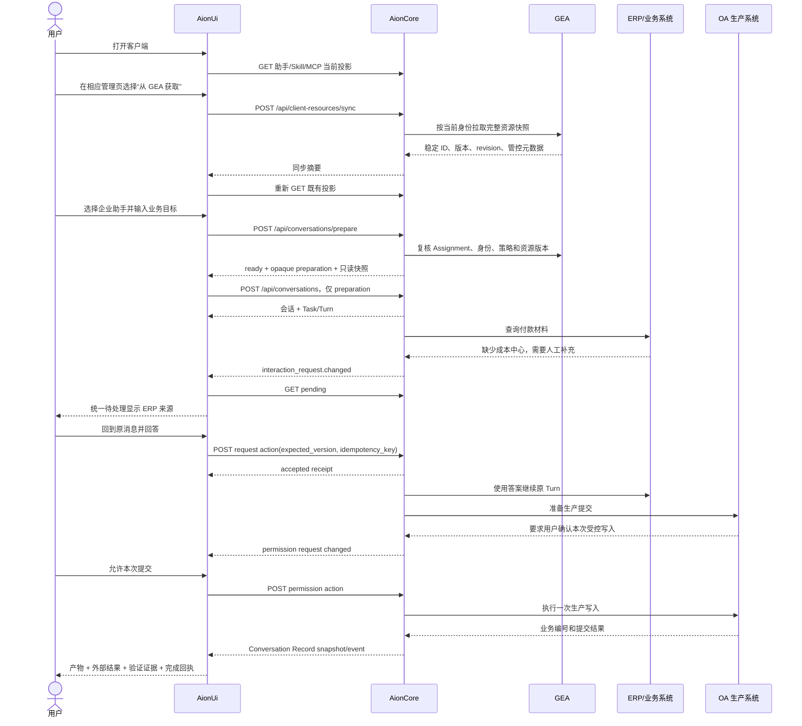

# GEA 企业智能体业务生命周期与交互链路 V1

> 状态：客户端 Mock E2E 已验证，待 GEA/AionCore 联调
>
> 日期：2026-08-12
>
> 关联对接稿：`docs/specs/gea-client-resource-sync-v1.zh-CN.md`

## 1. 这条业务流解决什么问题

企业用户不是先理解 Assistant、Skill、MCP、Agent 等技术对象，再决定如何组合。真实路径是：打开客户端，获得企业分配的工作能力，发起一项业务任务，在需要人判断或授权时处理待办，然后回到原任务，最后看到可核验的业务结果。

因此客户端只保留一条主旅程：

```text
打开客户端
  → 从 GEA 同步企业助手 / Skill / MCP
  → 选择企业助手并发起业务任务
  → AionCore 原子准备并冻结运行配置
  → Agent 执行，业务系统按需产生待处理请求
  → 用户从统一待处理入口回到原会话、原 Turn、原消息处理
  → Agent 继续原任务
  → AionCore 发布产物、外部结果、验证证据和完成回执
```

这不是六套独立功能的拼接。助手是工作入口，Skill/MCP 是准备阶段解析的能力，待处理是运行中的暂停状态，完成回执是同一个 Task 的结束条件。

## 2. 权威边界

| 事实                                     | 权威来源                                 | 客户端职责                                      |
| ---------------------------------------- | ---------------------------------------- | ----------------------------------------------- |
| 企业助手、Assignment、必需能力和管控状态 | GEA                                      | 展示、显式触发同步，不允许改企业核心配置        |
| 当前设备可用的 Skill/MCP/Agent 投影      | AionCore                                 | 在既有管理页展示同步结果和设备状态              |
| 会话最终运行配置                         | AionCore `prepare` 快照                  | 只提交助手意图；创建时只消费 opaque preparation |
| 业务 Task、Turn 和运行状态               | AionCore                                 | 展示当前工作，不从聊天文本猜测完成              |
| 问题、权限、审批等待办状态               | 发起业务系统 + AionCore 投影             | 聚合展示并把用户送回原上下文                    |
| 生产系统写入结果                         | 业务系统，经 AionCore 记录               | 不因按钮点击就宣称成功                          |
| 完成状态                                 | AionCore completion receipt + 有效证据链 | 只在证据有效时显示已完成                        |

GEA 不直接控制 Renderer，业务系统也不直接把 UI 卡片推给客户端。所有目录、运行、待处理和记录都经过 AionCore 的 HTTP/WS 契约。

## 3. 完整业务时序



## 4. 客户端分阶段交互

| 阶段       | 用户看到什么                           | 用户动作                 | 必须满足的状态条件                                  | 失败时停在哪里                            |
| ---------- | -------------------------------------- | ------------------------ | --------------------------------------------------- | ----------------------------------------- |
| 客户端打开 | 首页、已启用助手、待处理数量           | 正常进入或打开管理页     | 当前身份已建立；旧投影可读取                        | 登录/后端错误原位提示，不伪造资源         |
| 资源同步   | 助手、技能、工具页统一的“从 GEA 获取”  | 分别同步当前资源类型     | 每次请求只含 `assistants`、`skills` 或 `mcps`       | partial/unavailable 保留旧投影并显示错误  |
| 助手选择   | 企业助手卡、企业管理标记、受管核心能力 | 查看或开始对话           | Assignment active、客户端版本满足                   | suspended/withdrawn/too-old 禁止启动      |
| 会话准备   | “正在准备工作环境”，可取消             | 等待或取消               | Skill/MCP/Agent、身份、策略一次性全部通过           | 任一缺失即 blocked，不创建半配置会话      |
| 任务执行   | 原会话中的运行状态和消息               | 继续提供普通输入         | Task/Turn 由 AionCore 持久化                        | runtime 中断后按同一会话恢复              |
| 问题待办   | 待处理抽屉显示标题、摘要、来源系统     | 打开并回答               | request 仍 pending，version 匹配                    | conflict/expired/forbidden 刷新权威状态   |
| 生产权限   | 原消息内显示具体操作、一次允许/拒绝    | 明确授权一次             | action 在 allowed_actions 内                        | unknown external write 锁定重试并要求核验 |
| 原任务恢复 | 回到同一会话、同一 Turn 后续消息       | 无需创建新会话或手工转述 | accepted receipt 已记录                             | 未 accepted 不得假装 Agent 已继续         |
| 任务完成   | 产物、业务编号、验证证据、完成回执     | 查看/打开交付物          | completion receipt 引用通过的 verification evidence | 证据缺失或 inconclusive 不显示已完成      |

## 5. 五条相互衔接的状态链

### 5.1 企业资源

```text
unknown → syncing → fresh
                 ↘ partial / unavailable → 保留 last-good → retrying
fresh → stale（目录通知、身份变化、离线过期）→ syncing
```

助手、Skill、MCP 可以分页面同步，但进入受管会话前必须由 `prepare` 对同一身份上下文重新汇总；页面上的“同步成功”不等于会话已具备运行条件。

### 5.2 会话准备

```text
idle → preparing → ready → consumed → conversation created
             ↘ blocked
             ↘ cancelled（晚到 ready 不得继续 create）
```

### 5.3 Task/Turn

```text
running → awaiting_human → running → awaiting_permission → running → verified
                                                ↘ failed / verification_required
```

待办是原 Task 的暂停原因，不是另建一个无关联任务。每个请求至少携带 `conversation_id`，并尽量携带 `turn_id`、`message_id`；Team 还要携带 `team_id` 和 `slot_id`。

### 5.4 Interaction Request

```text
pending(v1)
  → accepted / already_resolved
  → conflict(v2) → GET pending → 用户基于 v2 再决定
  → expired / forbidden
  → unknown_external_write → verification_required（禁止自动重试）
```

动作必须带 `expected_version` 和稳定 `idempotency_key`。客户端双击、跨窗口重复提交或网络重放不能产生第二次业务写入。

### 5.5 Conversation Record

```text
context_evidence
  → deliverable_revision
  → external_result
  → verification_evidence（引用底层证据）
  → completion_receipt（引用通过的 verification evidence）
```

“用户点击允许”“Agent 说已完成”都不是完成证据。生产系统的成功 reference、产物版本和验证记录必须组成可追溯链。

## 6. AionCore 对客户端的最小契约组合

| 目的         | HTTP                                                             | 实时事件                                              |
| ------------ | ---------------------------------------------------------------- | ----------------------------------------------------- |
| 显式同步     | `POST /api/client-resources/sync`                                | 可选 `client_catalog.changed`                         |
| 刷新资源投影 | `GET /api/assistants`、`GET /api/skills`、`GET /api/mcp/servers` | —                                                     |
| 原子启动     | `POST /api/conversations/prepare`、`POST /api/conversations`     | —                                                     |
| 发起任务     | `POST /api/conversations/{id}/messages`                          | Agent/runtime 消息流                                  |
| 聚合待办     | `GET /api/interaction-requests?status=pending`                   | `interaction_request.changed`、`realtime.reconnected` |
| 处理待办     | `POST /api/interaction-requests/{id}/actions`                    | 后续原 Turn 消息/状态                                 |
| 核验交付     | `GET /api/conversations/{id}/records`                            | `conversation.record`                                 |

业务系统将待办交给 AionCore 时，至少要提供稳定 request ID、版本、来源、关联上下文、允许动作和更新时间。业务系统返回生产结果时，AionCore 必须先记录外部结果和验证证据，再发布 verified completion receipt。

## 7. Mock E2E 固定场景

可执行用例：`tests/e2e/features/assistants/enterprise-business-lifecycle.e2e.ts`。

固定业务样例：

- 企业助手：`enterprise-payment-review`。
- 企业 Skill：`skill-payment-policy@2.4.1`。
- 企业 MCP：`mcp-oa-production@1.7.0`，`production_write=true`，企业委派认证。
- 用户目标：复核付款申请 `PAY-20260812-001` 并提交生产系统。
- ERP 待办：补充成本中心，类型 `question`。
- OA 待办：确认一次生产提交，类型 `permission`。
- 外部结果：`OA-PAY-20260812-001`。
- 最终产物：`payment-review.xlsx`。
- 完成定义：企业付款申请已复核并提交，必须引用通过的核验证据。

自动化断言不只看页面：它还固定检查三类同步请求顺序、受管 `prepare`、opaque create、两个 request action 的版本与动作、原 Turn 后续消息、空待办和最终结构化记录。

页面验收还会从左栏“企业付款复核项目”真实点击付款任务，并断言同一任务依次显示“进行中 → 待处理 → 已完成”。连续交互录像位于 `tests/e2e/videos/enterprise-business-lifecycle/enterprise-business-lifecycle.webm`，与阶段截图一起保存在仓库内。

## 8. 联调边界

本轮 Mock E2E 使用真实 Electron 客户端壳和真实 Renderer 交互，只在 AionCore/GEA/ERP/OA 系统边界返回固定数据。因此已经验证客户端状态链与契约组合，但不代表真实生产写入已执行。

联调时建议按以下顺序替换 Mock：

1. GEA 测试租户的助手/Skill/MCP 完整快照。
2. AionCore 的同步投影与会话 `prepare`。
3. 可控的 ERP question fixture 和断线重连恢复。
4. 只写测试环境的 OA permission 与幂等提交。
5. 外部结果、verification evidence 和 completion receipt。

任何一步出现 `unknown_external_write` 都停在核验状态；不得为了跑通演示而自动重发生产动作。
